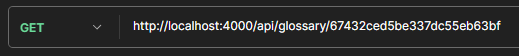

# Blockchain Glossary API

## API Endpoints 

### 1. **Get All Glossary Items**
- **Method**: GET
- **Endpoint**: /api/glossary
  Retrieves all glossary items from the database.


### 2. **Create a New Glossary Item**
- **Method**: POST
- **Endpoint**: /api/glossary
  
  Adds a new glossary item with a term and its definition. 

  **Request Body** (JSON):
  ```
  {
    "item": "Test",
    "definition": "This is a tessst"
  }
  ```
  

### 3. **Get a Glossary Item by ID**
- **Method**: GET
- **Endpoint**: /api/glossary/:id
    Retrieves a single glossary item by its unique ID.




### 4. **Update a Glossary Item by ID**
- **Method**: PUT
- **Endpoint**: /api/glossary/:id
  
  Updates an existing glossary item by its ID.

  **Request Body** (JSON):
  ```
  {
    "item": "Test",
    "definition": "This is a test"
  }
  ```


### 5. **Delete a Glossary Item by ID**
- **Method**: DELETE
- **Endpoint**: /api/glossary/:id
  
  Deletes a glossary item by its ID.


### Techkstack 
- NodeJS
- MongoDB

--- 

This API is hosted live, check links section on github
